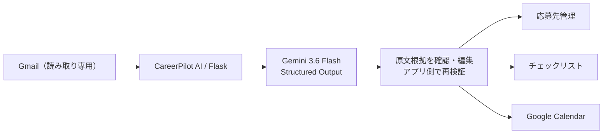
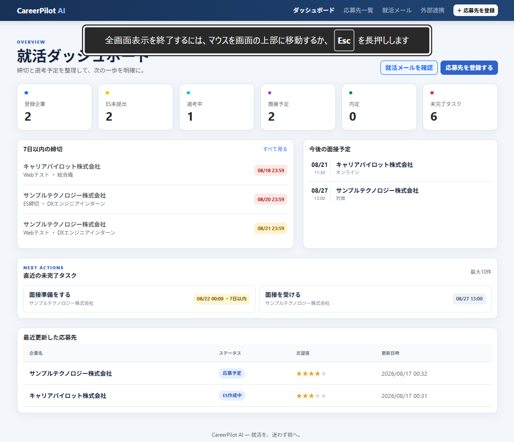
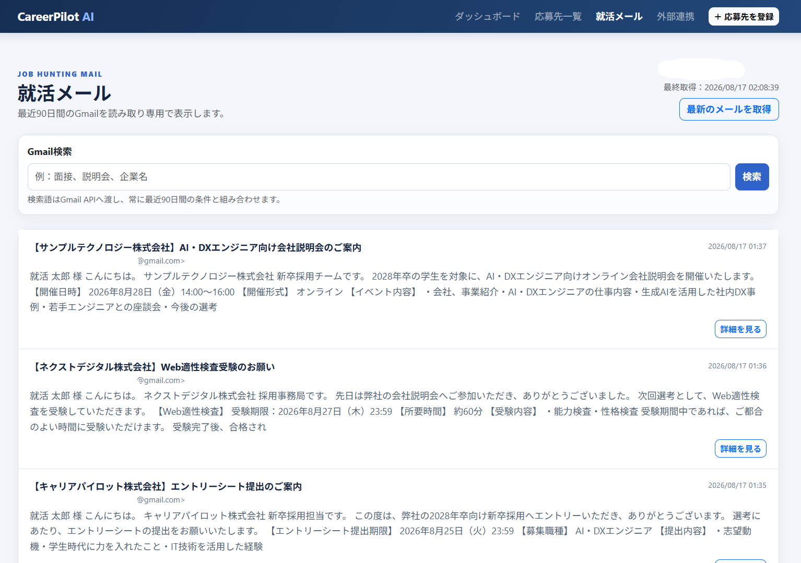
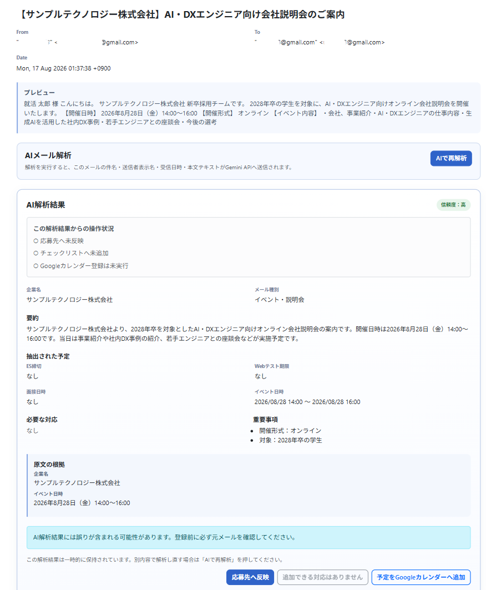
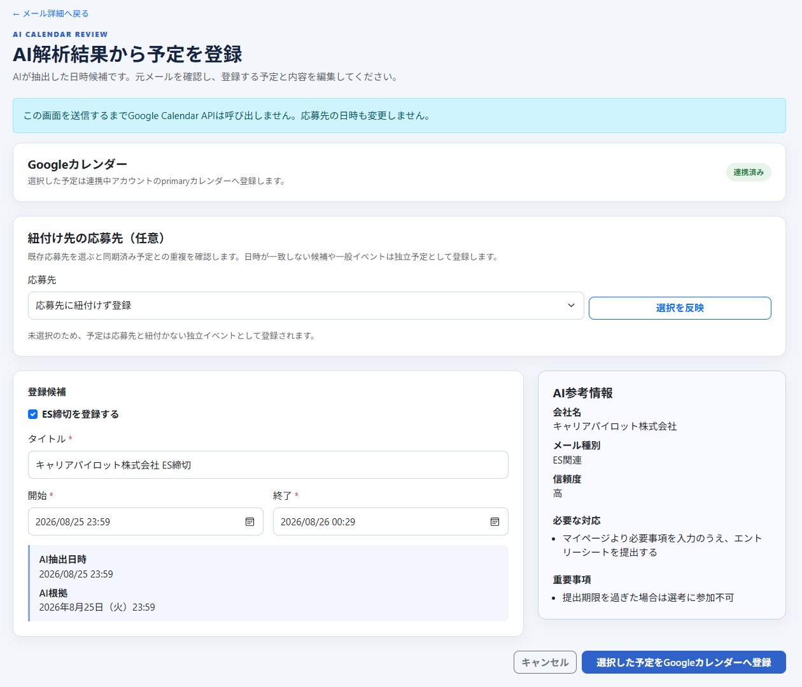
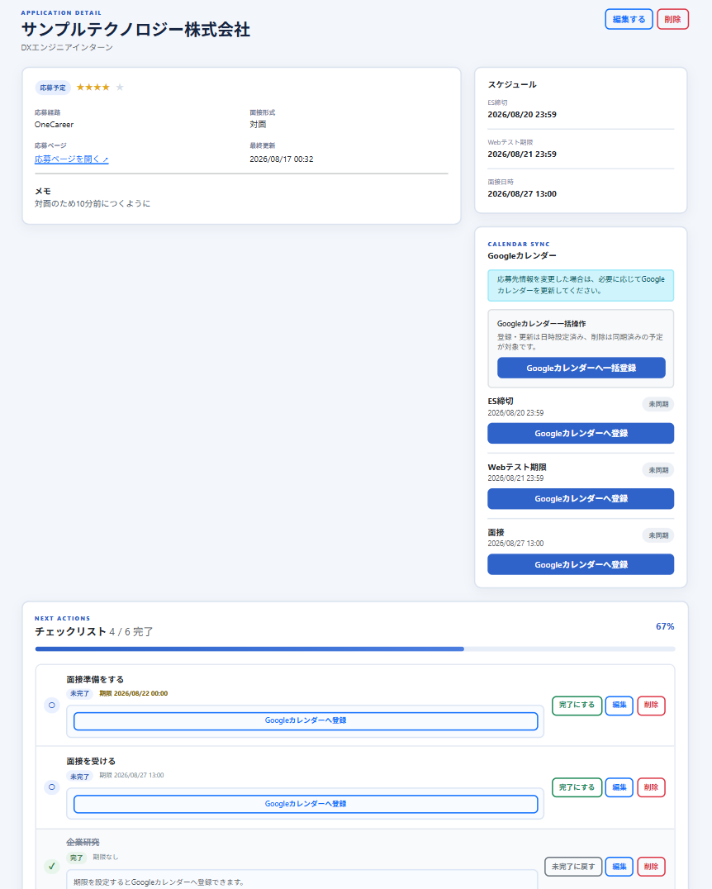
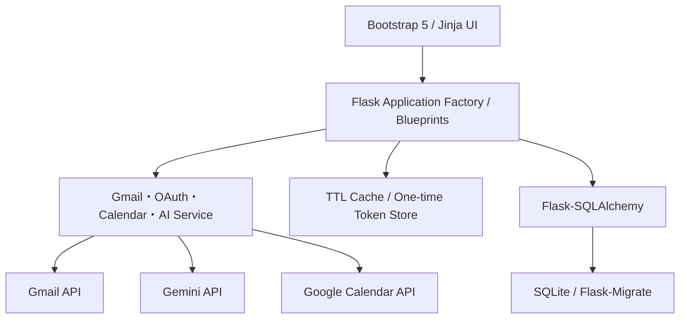
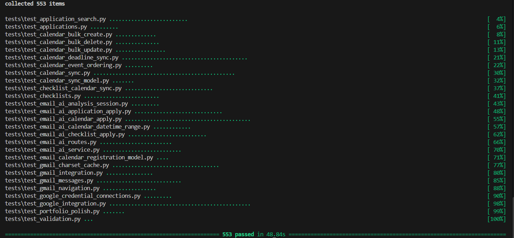

# CareerPilot AI

> Gmailの就活メールをGemini 3.6 Flashで構造化し、応募先管理・チェックリスト・Google CalendarへつなげるHuman-in-the-loop型の就活支援Webアプリです。

## 概要

CareerPilot AIは、応募先・締切・面接・タスクを一元管理するFlask製Webアプリです。Gmail APIから読み取った選考案内をGeminiのStructured Outputで解析し、企業名、期限、面接日時、必要な対応と、その判断根拠となるメール原文（evidence）を確認画面へ表示します。

AIの結果を直接保存・外部登録せず、ユーザーが原文を確認して候補を編集し、アプリ側の再検証を通過した場合だけApplication、ChecklistItem、Google Calendarへ反映します。

## 開発背景・課題

- 就活が進むほど企業ごとのメール、締切、面接予定が複数サービスへ分散する
- 応募先、カレンダー、タスクへの転記に手間がかかり、入力漏れも起きやすい
- メール本文から次の行動を判断する負担があり、重要な期限を見落とすリスクがある
- AIによる自動登録だけでは、誤抽出や曖昧な日時がそのまま反映される危険がある

## 解決方法



AIは候補の抽出までを担当し、保存・外部登録は必ず確認画面からユーザーが実行します。1回のAI解析結果を10分間再利用できるため、Application反映、Checklist追加、Calendar登録を連続して進められます。

## 主な機能

- 応募先CRUD、検索・絞り込み・並び替え、進捗ダッシュボード
- 応募先別チェックリスト、進捗率、期限の優先表示、標準タスク自動作成
- Gmail OAuthと読み取り専用のメール一覧・検索・詳細表示
- 60秒のGmail一覧キャッシュと、検索条件・ページ位置を保つ戻り導線
- Geminiによるメールの構造化解析、根拠表示、10分間の解析セッション再利用
- AI候補を確認・編集してApplication、Checklist、Google Calendarへ反映
- 面接・ES締切・Webテスト期限・Checklist期限のCalendar同期
- Calendar予定の個別／一括登録・更新・削除と重複登録防止
- Flask-WTFのCSRF対策、Flask-Migrate、404・400・500エラー画面
- Bootstrap 5によるPC・スマートフォン対応UI

日時は日本時間として入力・表示し、SQLiteにはタイムゾーン情報を持たない日本時間の値として保存します。

## Screenshots

### Dashboard

応募企業数、ES未提出数、選考状況に加え、直近の締切・面接予定・未完了タスクをまとめて確認できます。

<p align="center">
  
</p>

### Gmail × AIメール解析

Gmail APIから就活メールを読み取り専用で取得し、検索・ページ移動・詳細確認ができます。

<p align="center">
  
</p>

選択したメールをGemini 3.6 Flashで構造化し、企業名、メール種別、要約、日時、必要な対応、原文根拠（evidence）を確認できます。解析結果からApplication、Checklist、Google Calendarの3方向へ進む操作も、この画面に集約しています。

<p align="center">
  
</p>

### Human-in-the-loop × Google Calendar

AIが抽出した日時と原文根拠を確認し、タイトル・開始・終了日時を編集してから、ユーザー操作でGoogle Calendarへ登録します。

<p align="center">
  
</p>

### 応募先・Checklist管理

応募状況、締切、Checklistの進捗、Google Calendarとの同期状態を応募先単位で管理します。

<p align="center">
  
</p>

画像更新時の匿名化チェックは[docs/images/README.md](docs/images/README.md)にまとめています。

## AIメール解析とHuman-in-the-loop設計

- Gemini JSON SchemaによるStructured Outputと、アプリ側の型・日時・文字数検証を併用
- 抽出値に加えて短い原文根拠（evidence）を表示し、元メールとの照合を可能にする
- 不明値を推測しない指示と、時刻・タイムゾーンを確定できない日時を自動候補にしない検証
- メール本文中の命令をデータとして扱うPrompt Injection対策
- AIへDB、Gmail変更、Calendar登録などのtool権限を渡さない
- AI候補は自動保存せず、Human-in-the-loopの確認画面を必須にする

## システム構成



外部API処理、Credential保存、Calendar同期、AI解析、一時ストアをrouteから分離しています。Application FactoryとBlueprintにより、テストでは外部通信をモックし、インメモリSQLiteへ差し替えます。

## 使用技術

| 分類 | 技術 |
| --- | --- |
| Backend | Python 3.12、Flask、Flask-WTF |
| Database | Flask-SQLAlchemy、SQLite、Flask-Migrate / Alembic |
| Frontend | Jinja2、Bootstrap 5、CSS、最小限のJavaScript |
| Google APIs | Gmail API、Google Calendar API、OAuth 2.0、google-auth、google-auth-oauthlib、google-api-python-client |
| AI | Gemini 3.6 Flash、Google Gen AI SDK（`google-genai`）、JSON Schema Structured Output |
| Test | pytest、Flask test client、モック化したGoogle / Gemini通信 |
| Security | Flask-WTF / CSRF、OAuth state、PKCE、入力再検証、安全なログ |

## セキュリティ設計

- POST操作のCSRF保護、OAuth state検証、PKCE、認可コードの一度限り利用
- Gmailは`gmail.readonly`、Calendarは`calendar.events`の必要最小スコープ
- Calendar用とGmail用Credentialを用途別・所有者別に分離
- access token、refresh token、client secret、API key、メール本文を安全ログへ出さない
- `return_to`はアプリ内の`/emails`一覧URLだけを許可し、open redirectを防止
- AI出力を再検証し、ユーザー確認前にDB・Calendarへ反映しない
- メール由来予定をハッシュ化した識別値で追跡し、再解析後の重複登録も防止
- `.env`、SQLite、バックアップ、キャッシュ、一時ファイルをGit管理対象外にする

これらはリスクを低減するための実装であり、本番運用に必要な保護をすべて満たすものではありません。現在は単一ユーザー向けローカルMVPで、Google tokenをSQLiteへ平文保存します。本番ではtoken暗号化、Secret Manager、ユーザー認証・権限管理、PostgreSQL等への移行が必要です。

## 標準チェックリスト

応募先登録画面の「標準チェックリストを作成する」は初期状態でオンです。オンのまま登録すると、次の7項目を自動作成します。

1. 企業研究
2. ESを作成する
3. ESを提出する
4. Webテストを受験する
5. 面接日程を確認する
6. 面接準備をする
7. 面接を受ける

チェックを外した場合は自動作成されません。

## 応募先検索・絞り込み

応募先一覧では、次の条件をGETパラメータで指定できます。検索条件はURLとフォームに保持されるため、再読み込みやURL共有でも同じ結果を表示できます。

| パラメータ | 内容 | 例 |
| --- | --- | --- |
| `q` | 会社名・職種名の部分一致検索 | `Zenith` |
| `status` | 応募ステータス | `応募予定` |
| `priority` | 指定した志望度以上 | `4` |
| `deadline` | 締切状態 | `overdue`, `3days`, `7days`, `14days`, `none` |
| `sort` | 並び替え | `updated_desc`, `company_asc`, `deadline_asc` |

使用例：

```text
/applications?q=Zenith&status=応募予定&priority=4&deadline=7days&sort=deadline_asc
```

キーワードの前後空白は除去され、大文字・小文字を区別せず検索します。不正なステータス、志望度、締切、並び替え値はエラーにせず、「すべて」または既定の「更新日時が新しい順」として扱います。

締切判定にはES締切とWebテスト期限を使用します。今後の締切がある場合は最も近い日時、すべて期限切れの場合は直近に過ぎた日時を判定対象にします。3日・7日・14日以内の条件は現在時刻から各日数までを含み、締切なしは両方とも未設定の応募先です。

## Google連携（Calendar / Gmail）

`/settings/integrations` からGoogle OAuth 2.0の認証を開始し、連携状態の確認と解除ができます。Google連携後は、面接日時が設定された応募先の詳細画面から、その面接をGoogle Calendarのメインカレンダーへ作成・手動更新・削除できます。

Google認証情報は`connection_type`で用途別に管理します。Calendar接続は`calendar`、Gmail接続は`gmail`として独立保存するため、Google Calendarには普段使いのアカウント、Gmailには就活用アカウントという別アカウント構成を利用できます。両方のOAuth開始・状態表示・解除に加え、Gmail APIを使った就活メールの読み取り専用一覧・詳細表示と、ユーザーが明示実行するGemini AI解析を実装しています。AI候補はユーザー確認なしに応募先やカレンダーへ自動登録しません。

使用するスコープは次の最小構成です。

- `openid`
- `https://www.googleapis.com/auth/userinfo.email`
- `https://www.googleapis.com/auth/calendar.events`

`openid` と `userinfo.email` は連携したアカウントのメールアドレス表示、`calendar.events` はイベント作成・更新・削除に使用します。プロフィール全体や、必要以上に広いCalendarスコープは要求しません。設定に短縮名`email`が残っている場合も、OAuth開始前に標準URIへ正規化します。

Gmail OAuthは次の読み取り専用スコープだけを使用します。

- `openid`
- `https://www.googleapis.com/auth/userinfo.email`
- `https://www.googleapis.com/auth/gmail.readonly`

Gmail接続へ`calendar.events`、`gmail.modify`、`gmail.send`、`mail.google.com`、`profile`は要求しません。メールの既読化、ラベル変更、移動、削除、送信など、Gmail側の状態を変更する処理は行いません。

### 就活メール一覧（読み取り専用）

Gmail連携後、ナビゲーションの「就活メール」または`/emails`からメール一覧を表示できます。初期表示ではGmail検索条件`newer_than:90d`を使用し、直近90日間のメールを新しい順に最大50件取得します。件名、差出人、受信日時、スニペットを一覧表示し、詳細画面では宛先と本文も確認できます。

検索欄へ入力した値はGmail APIの検索クエリとして渡されます。例えば`from:example.com`、`subject:面接`、`after:2026/08/01`など、Gmailと同じ検索演算子を利用できます。空欄の場合は直近90日条件を維持します。Gmail APIから`nextPageToken`が返された場合は「次へ」「前へ」でページ移動でき、検索条件も保持されます。

一覧から詳細を開く際は、検索条件、現在のpage token、ページ履歴を内部の戻り先として引き継ぎます。詳細の「検索結果へ戻る」から同じ検索・同じページへ戻れ、TTL内であれば既存の一覧キャッシュを再利用します。戻る操作には`refresh=1`を引き継がないため、詳細から戻っただけではGmail APIを強制再取得しません。戻り先は同一アプリの`/emails`一覧URLだけを許可し、外部URLや詳細URLは既定の`/emails/`へ置き換えます。

本文は`text/plain`を優先し、ない場合は`text/html`を安全なプレーンテキストへ変換します。UTF-8、ISO-2022-JP、Shift_JIS、Windows-31J / CP932、EUC-JPと一般的なcharset aliasに対応し、MIMEの`Content-Type`指定を最優先にします。charset未指定時は日本語向けcodecを安全にフォールバックし、HTMLではMIME指定がない場合に限り`meta charset`も補助利用します。Gmail APIの`body.data`はbase64urlを一度だけデコードし、MIMEのContent-Transfer-Encodingを二重処理しません。

HTMLをそのまま描画せず、Jinjaの自動エスケープも維持します。添付ファイルは取得・保存・表示せず、本文とスニペットには表示上限を設けています。取得した本文やメタデータはDBへ保存しません。

一覧結果は同じ所有者、Gmailアカウント、検索条件、ページについて、デフォルト60秒だけプロセス内メモリへ保存します。一覧へ戻った際は有効な結果を再利用し、`messages.list`と各`messages.get`の再実行を抑えます。「最新のメールを取得」を押すと対象結果を無視してGmail APIから再取得し、取得時刻と一覧を更新します。Gmail側で削除・受信などの変更があっても、通常表示には最大60秒ほど反映されない場合があります。

キャッシュはthread-safeかつ最大エントリ数付きで、期限切れと古いエントリを削除します。保存対象は一覧表示用情報とページネーション情報だけで、本文、access token、refresh token、client secretは保存しません。現在はローカル単一プロセス向けのため、本番で複数プロセス化する場合はRedis等の共有TTLキャッシュへ置き換えてください。

Gmail未連携時はAPIへアクセスせず、外部連携設定への案内を表示します。認証期限切れや権限不足、レート制限、Google側の一時障害も画面上の案内へ変換し、メール本文、件名、メールアドレス、メッセージID全文、トークン、Google APIレスポンス本文をログへ記録しません。

### GmailメールのGemini AI解析

メール詳細の「AIでメールを解析」を明示的に押した場合だけ、対象メール1件をGemini APIへ送信します。一覧表示・詳細表示・一覧キャッシュではGeminiを呼びません。送信対象は件名、送信者表示名（ない場合は送信者情報）、受信日時、安全にテキスト化済みの本文だけです。Gmail message ID、To、OAuth token、Credential、他メール、応募先一覧、HTML生データ、添付ファイルは送信しません。

本文は最大18,000文字とし、長文では冒頭70%と末尾30%を残します。GeminiのJSON Schema構造化出力とアプリ側検証を組み合わせ、企業名、メール種別、ES締切、Webテスト期限、面接日時、一般イベントの開始・終了日時、必要な対応、重要事項、要約、信頼度、短い原文根拠を表示します。一般イベントは`event_start_datetime`と`event_end_datetime`を分け、後方互換用の`event_datetime`は開始日時と同値にします。年・日付・具体的時刻を確定できない表現は無理にISO日時へせず、元の日時表現を別項目として残します。

メール本文は信頼できない入力として扱い、本文中の命令・役割変更・秘密開示要求を無視するsystem instructionを使用します。Geminiへtoolやメール送信・DB・Calendar操作権限は渡しません。不明な情報はnull、原文にない会社名や期限は作らないこと、evidenceは実在する短い原文だけにすることを指示します。構造化出力でも意味上の誤りは起こり得るため、結果画面には必ず元メールを確認する注意を表示します。

解析成功時は、構造化AI結果を再利用可能な「解析セッション」としてプロセス内メモリへ最大10分、最大128件、1件32KBまで一時保持します。解析セッションのURLから同じメール詳細を再表示すると、TTL内はGemini APIを再実行せず同じ結果を表示できます。Application反映、Checklist追加、Calendar登録の成功後も元セッションは消費せず解析結果へ戻るため、1回の解析から3操作を続けて実行できます。操作状況と登録先への補助リンクもTTL内だけ表示します。

各操作には解析セッションから発行した用途別のワンタイムトークンを使い、Application用トークンをChecklist操作へ流用することはできません。元セッションはGmail messageのSHA-256識別値とGmail接続のSHA-256識別値に結び付け、別メール・別接続からの利用を拒否します。Gmail本文全体、OAuth token、APIキーは解析セッション、Cookie session、DB、一覧キャッシュへ保存しません。期限切れ・改ざん時は500にせず再解析を案内します。APIキー未設定、通信失敗、rate limit、timeout、schema不一致、安全性による空応答でもGmail閲覧機能は継続利用できます。件名、本文、送信者、message ID、解析token、APIキー、prompt全文、AIレスポンス、抽出値はログへ記録しません。本番を複数プロセス構成にする場合は、暗号化・期限・サイズ制限を維持できる共有一時ストアへの置き換えが必要です。

メール詳細ではプレビューの直後にAI解析操作と解析結果を表示します。元メール本文は画面下部の「メール本文を確認する」から必要なときだけ展開でき、AI結果と照合できます。

解析成功後の「応募先へ反映」では、AI候補を直接保存せず、必ず確認・編集画面を表示するHuman-in-the-loop設計です。会社名、職種、ステータス、志望度、ES締切、Webテスト期限、面接日時、メモを再検証したうえで、新しいApplicationの作成または選択した既存Applicationの更新を行います。既存Applicationでは現在値を先に読み込み、AI候補と比較して最終値をユーザーが決めます。同じ会社名がある場合は警告しますが、複数職種への応募を考慮して登録自体は禁止しません。

新規Application作成時は標準7項目Checklistの作成有無を選べます。締切や面接日時をApplicationへ保存してもGoogle Calendarへは自動同期せず、従来どおり応募先詳細から個別または一括で手動同期します。AI結果には誤りがあり得るため、保存前に元メールを確認してください。

AI解析結果の「必要な対応をチェックリストへ追加」では、`action_items`を自動登録せず、登録先Applicationを選んだ確認画面で、追加有無、タイトル、期限をユーザーが編集してからChecklistItemへ一括保存します。1件でも入力エラーがあれば全件保存せず、保存成功時だけ一時トークンを一回消費します。既存の同名未完了タスクや標準Checklistと重なる候補は「既存タスクあり」と警告しますが、期限違いなどを考慮して確認後の追加は許可します。

期限の自動候補は、項目全体が「ESを提出する」または「Webテストを受験する」等の限定した意味に一致し、対応するタイムゾーン付き日時がAI結果にある場合だけ日本時間へ変換します。面接日時、曖昧な文言、不正ISO日時、時刻未確定の原文だけの場合は期限を空欄にし、23:59などを補完しません。保存したChecklistItem期限もGoogle Calendarへ自動同期せず、応募先詳細の個別同期ボタンからユーザーが明示的に登録します。重要事項、信頼度、原文根拠は確認用であり保存対象ではありません。

AI解析結果の「予定をGoogle Calendarへ追加」では、`es_deadline`、`web_test_deadline`、`interview_datetime`、`event_start_datetime`のうちタイムゾーン付きで確定した日時だけを候補にします。一般イベントの終了日時が原文から確定した場合は`event_end_datetime`をそのまま優先し、未確定の場合だけ候補生成側で60分を設定します。面接は60分、ES締切・Webテスト期限は30分という既存デフォルトを維持します。日をまたぐ明示範囲も終了側の日付を保持します。確認画面ではAI構造化日時と原文根拠を分けて表示し、予定ごとの選択、タイトル、開始・終了日時を編集したうえで、全入力の検証後にだけGoogle Calendarへ登録します。AIが直接自動登録することはなく、日時の原文表現しかない候補や時刻不明の候補へ23:59等を補完しません。終了日時が開始以前なら登録前に拒否します。

既存Applicationの選択は任意です。対応するApplication日時と確認後の開始日時が一致し、同種のCalendarSyncが未作成の場合だけ既存CalendarSyncへ紐付けます。同期済みならGoogleイベントを重複作成せず警告し、日時が異なる場合と一般イベントは独立イベントとして扱います。AI候補をApplicationの日時へ勝手に保存・更新することはありません。複数候補は個別にAPI登録し、一部が失敗しても成功した予定を自動削除せず、成功件数と失敗件数を表示します。登録前には必ず元メールを確認してください。

メール由来の独立予定は`EmailCalendarRegistration`で追跡します。生のGmail message IDやGoogleアカウント識別子は保存せず、それぞれをSHA-256で仮名化したキーと、候補種別、provider、Google event IDを保持します。同じメール・同じ候補種別・同じCalendar接続は1件に限定し、再解析後の再送信でも`events.insert`を呼びません。登録済み候補は確認画面で選択解除・無効化されます。「Google側の登録状態を確認」を明示実行し、Google側が404、410または`status=cancelled`なら追跡情報だけを解除して再登録可能にします。自動再作成はしません。Google作成後に追跡情報のDB保存だけが失敗した場合は500にせず、Google側に予定が存在する可能性と、再操作前にCalendarを確認する案内を表示します。

### Google Calendarイベント同期（Phase 5）

応募先詳細から、次の3種類をGoogle Calendarの`primary`カレンダーへ登録できます。

- 面接: `event_type=interview`、タイトル`{会社名} 面接`、面接日時から60分
- ES締切: `event_type=es_deadline`、タイトル`{会社名} ES締切`、ES締切日時から30分
- Webテスト期限: `event_type=web_test_deadline`、タイトル`{会社名} Webテスト期限`、Webテスト期限日時から30分

各イベントは応募先詳細から個別に手動で登録・更新・削除できます。加えて「Googleカレンダーへ一括登録」では、3種類のうち日時が設定され、まだ同期されていない予定だけをまとめて登録します。同期済みまたは日時未設定の予定はスキップし、既存のGoogleイベントを上書きしません。

一括登録はイベントごとに同期情報を確定するため、途中の1件がGoogle APIエラーになっても、それ以前に成功した予定は同期済みのまま保持します。失敗した予定だけが未同期で残り、再実行時はその時点で日時設定済み・未同期の予定だけが対象になります。

「Googleカレンダーへ一括更新」では、日時が設定され、すでに同期済みの予定だけをApplication側の最新情報でまとめて更新します。未同期イベントを新規作成することはありません。各イベントは更新前にGoogle側の存在とstatusを確認し、404、410、または`status=cancelled`なら対応する`CalendarSync`だけを削除して未同期へ戻します。一般APIエラーでは同期情報を維持し、他の予定の更新を継続します。応募先の編集保存時にGoogle Calendarへ自動同期はしません。

「Googleカレンダーから一括削除」では、同期済みの3種類をGoogle Calendarからまとめて削除し、対応する`CalendarSync`だけを削除します。Application側の面接日時、ES締切、Webテスト期限、応募先情報は残ります。Application側の日時が未設定でも同期情報があれば削除対象です。404、410、または`status=cancelled`はGoogle側ですでに削除済みとして同期情報を削除し、一般APIエラーになった予定の同期情報は維持します。一部が失敗しても成功済みの削除は維持します。Google未連携時はGoogle APIも同期情報の削除も実行しません。

ChecklistItemに期限が設定されている場合は、応募先詳細の各チェック項目から`event_type=checklist_due`のGoogle Calendar予定を個別に登録・更新・削除できます。タイトルは`{会社名} - {タスク名}`、開始は期限、終了は30分後で、説明には会社名、応募職種、タスク名、応募ステータス、完了状態、期限を含めます。タスク編集や完了切替では自動更新せず、同期済み表示から手動更新します。

ChecklistItemのCalendarSyncは`checklist_item_id`を所有者として保存し、Application側の一括登録・一括更新・一括削除には含めません。ChecklistItemまたはApplicationをCareerPilot AI側で削除するとCalendarSyncはCASCADE削除されますが、Google Calendar側の予定は自動削除されません。必要なら先にチェック項目のGoogle Calendar削除操作を実行してください。

すべて終日イベントではなく、日本時間の時間指定イベントです。説明にはCareerPilot AIからの登録であること、会社名、応募職種、現在ステータス、メモを含め、締切イベントには期限種別も含めます。

- タイムゾーン: `Asia/Tokyo`
- 場所: 未設定

登録成功後はGoogleから返されたイベントIDを汎用的な`CalendarSync`レコードへ保存し、イベント種別ごとに「同期済み」表示へ切り替えます。同じ応募先・イベント種別・providerの同期レコードは一意制約で1件に限定し、画面操作による重複作成も事前に防止します。対象日時が未設定、Google未連携、またはAPIエラーの場合はイベントを作成しません。

`CalendarSync`は、ApplicationまたはChecklistItemへのnullableな外部キー、イベント種別、provider、calendar ID、外部イベントIDを保持します。2つの所有者外部キーは必ずどちらか一方だけを設定するCHECK制約を持ち、所有元の削除時にはDBのCASCADEで同期レコードも削除されます。現在UIとGoogle API操作に対応するイベント種別はApplicationの`interview`、`es_deadline`、`web_test_deadline`とChecklistItemの`checklist_due`です。

同期済みの応募先では、同じイベントIDを使ってタイトル・開始・終了・説明を手動更新できます。更新前にGoogle Calendarからイベントを取得し、`status`が`confirmed`または`tentative`であることを確認してからPATCHします。GETまたはPATCHの結果が`cancelled`の場合は削除済みとして同期状態を解除し、自動復元はしません。`status`がない、または未知の値の場合も安全のためPATCHせず、event IDを維持したままエラーを案内します。応募先の編集保存時には自動更新せず、詳細画面に手動更新の案内を常に表示します。同期日時や内容ハッシュは追加していないため、変更有無は自動判定しません。

「Googleカレンダーから削除」はGoogle側の該当イベントを削除し、CareerPilot AIの面接日時・ES締切・Webテスト期限は残したまま、対応する`CalendarSync`レコードだけを削除します。Google側でイベントが先に削除されていた場合も、APIの404 Not Found、410 Gone、または`status=cancelled`を検出して同期レコードを削除し、未同期状態へ戻します。削除済み判定後にイベントを自動再作成することはなく、ユーザーが改めて登録します。

Google連携を解除しても、作成済みのGoogle Calendarイベントは削除されません。また、応募先を削除してもGoogle側イベントは自動削除されないため、必要なら先に応募先詳細からカレンダー予定を削除してください。

現在はCareerPilot AIからGoogle Calendarへの手動操作のみです。Google側の変更取り込み、変更検知、自動再同期、双方向同期は未実装です。

## Google OAuth設定

### Google Cloud Consoleの設定

1. Google Cloud Consoleでプロジェクトを作成または選択します。
2. 「APIとサービス」からGoogle Calendar APIとGmail APIを有効化します。
3. OAuth同意画面を設定し、アプリ名と連絡先を入力します。
4. Data AccessへCalendar用の`calendar.events`と、Gmail用の`gmail.readonly`、`openid`、`userinfo.email`を追加します。Gmailの書き込み・送信スコープは追加しません。
5. 公開前のExternalアプリでは、Calendar用アカウントと就活用Gmailアカウントをテストユーザーへ追加します。
6. OAuthクライアントIDを「ウェブ アプリケーション」として作成します。CalendarとGmailで同じClient ID / Client Secretを利用できます。
7. 承認済みのリダイレクトURIへ、次の2つを`.env`と完全に同じ値で登録します。

   - Calendar: `http://127.0.0.1:5000/integrations/google/callback`
   - Gmail: `http://127.0.0.1:5000/integrations/google/gmail/callback`

既存のCalendar API、Calendarスコープ、Calendar用redirect URIは削除・置換せず、Gmail用設定を追加してください。

Google Cloud Consoleで発行されたクライアントIDとクライアントシークレットはリポジトリへコミットしないでください。

### 環境変数

`.env.example` を `.env` へコピーし、次を設定します。

```dotenv
FLASK_ENV=development
ALLOW_INSECURE_OAUTH=false
GOOGLE_CLIENT_ID=
GOOGLE_CLIENT_SECRET=
GOOGLE_REDIRECT_URI=http://127.0.0.1:5000/integrations/google/callback
GOOGLE_OAUTH_SCOPES=openid https://www.googleapis.com/auth/userinfo.email https://www.googleapis.com/auth/calendar.events
GOOGLE_GMAIL_REDIRECT_URI=http://127.0.0.1:5000/integrations/google/gmail/callback
GOOGLE_GMAIL_OAUTH_SCOPES=openid https://www.googleapis.com/auth/userinfo.email https://www.googleapis.com/auth/gmail.readonly
GMAIL_LIST_CACHE_TTL_SECONDS=60
GMAIL_LIST_CACHE_MAX_ENTRIES=128
GEMINI_API_KEY=
GEMINI_MODEL=gemini-3.6-flash
GEMINI_TIMEOUT_SECONDS=30
EMAIL_ANALYSIS_SESSION_TTL_SECONDS=600
EMAIL_ANALYSIS_SESSION_MAX_ENTRIES=128
EMAIL_ANALYSIS_SESSION_MAX_PAYLOAD_BYTES=32768
OAUTH_OWNER_KEY=local
```

`OAUTH_OWNER_KEY`は、ユーザー認証をまだ持たないローカル版で認証情報の所有者を識別する暫定キーです。将来の複数ユーザー化ではログインユーザーIDへ置き換えます。

`GMAIL_LIST_CACHE_TTL_SECONDS`は一覧の再利用秒数、`GMAIL_LIST_CACHE_MAX_ENTRIES`はプロセス内に保持する一覧条件数の上限です。未指定時はそれぞれ60秒、128件です。実際の`.env`は必要な場合だけ変更してください。

Gemini解析を利用する場合は、Google AI StudioでAPIキーを発行し、`GEMINI_API_KEY`へ設定してアプリを再起動します。既定モデルは`gemini-3.6-flash`、timeoutは30秒です。APIキーは画面、ログ、リポジトリへ出さないでください。未設定でもGmail・Calendarを含むアプリ全体は通常どおり起動します。

`EMAIL_ANALYSIS_SESSION_TTL_SECONDS`は、構造化AI解析結果をApplication・Checklist・Calendarの連続操作へ再利用できる秒数です。未指定時は600秒（10分）です。最大128件、1件32KBの上限は`EMAIL_ANALYSIS_SESSION_MAX_ENTRIES`と`EMAIL_ANALYSIS_SESSION_MAX_PAYLOAD_BYTES`で設定でき、実際の`.env`に値があればその値を優先します。セッションはプロセス内メモリだけに保存されるため、アプリ再起動時には失われます。

Gemini ClientはAI StudioのAPIキーを使うGemini Developer APIとして明示的に生成し、Vertex AIへ切り替えません。`GEMINI_MODEL`は`gemini-3.6-flash`のように`models/`なしで設定してください（誤って付けた場合もアプリ側で正規化します）。404応答は生のGoogleレスポンスをログへ出さず、モデル利用不可、endpoint不一致、未分類のNot Foundへ安全に分類します。

`GOOGLE_CLIENT_ID` または `GOOGLE_CLIENT_SECRET` が未設定でもアプリ全体は起動します。その場合、設定画面に不足項目を表示し、Google連携の開始だけを無効化します。

### ローカルでの接続確認

1. アプリを起動し、ナビゲーションの「外部連携」を開きます。
2. Calendarカードの「Googleと連携する」を押し、普段使いのテストユーザーで同意画面を完了します。
3. Gmailカードの「Gmailと連携する」を押し、アカウント選択画面から就活用Googleアカウントを選びます。
4. 設定画面でCalendarとGmailがそれぞれ「連携済み」となり、異なるメールアドレスを表示できることを確認します。
5. Gmail連携を解除し、Calendar連携とCalendarSyncが維持されることを確認します。
6. Calendar連携を解除し、Gmail Credentialが維持されることを確認します。

OAuth開始時は推測困難な`state`を用途別のセッションキーへ保存してコールバックで照合します。認可コードフロー、`access_type=offline`、`prompt=consent`を使用し、Gmailでは別アカウントを選びやすいよう`prompt=select_account consent`を指定します。Google側がrefresh tokenを再発行しなかった場合は、同じconnection typeのDB内既存値を保持します。

`google-auth-oauthlib`が生成するPKCE `code_verifier`はCookieセッションへ保存せず、stateとconnection typeに紐付けたサーバープロセス内の一時ストアへ最大10分間だけ保持します。CalendarとGmailを並行して開始してもstateは衝突しません。callbackで原子的に一度だけ取り出すため、再読み込み・同一stateの再利用・二重アクセスでは認可コードを再交換しません。認証途中でアプリを再起動した場合は一時情報が失われるため、各連携ボタンからやり直してください。本番の複数プロセス構成へ移行する場合は、この一時ストアをRedis等の共有・期限付きストアへ置き換えてください。

認可開始時、設定値、token交換時のredirect URIは完全一致を検証します。callback URLは設定済みredirect URIを基準に再構成し、ProxyFixや内部ホスト名による`request.url`の差異をtoken交換へ持ち込みません。診断ログにはURI全文ではなく、scheme、host種別、port、path一致結果だけを記録します。

OAuthの失敗時は、処理段階・例外クラス・安全な定型メッセージ・取得できた場合のみHTTPステータスをログへ記録します。認可コード、token、client secret、callback URL全文は記録しません。

`invalid_grant`の説明文もそのまま記録せず、`code_invalid_or_expired`、`code_already_used`、`redirect_uri_mismatch_during_exchange`、`pkce_verifier_mismatch`、`unknown_invalid_grant`のいずれかへ分類して記録します。

### ローカルHTTPでのOAuth確認

Googleは`localhost`と`127.0.0.1`のloopback redirect URIでHTTPを許可していますが、OAuthLibではローカル開発時にも明示的な許可が必要です。ローカルで接続確認するときだけ、`.env`を次のように設定してください。

```dotenv
FLASK_ENV=development
ALLOW_INSECURE_OAUTH=true
```

アプリは次の条件をすべて満たす場合だけ、プロセス環境の`OAUTHLIB_INSECURE_TRANSPORT`を`1`に設定します。

- `FLASK_ENV=development`
- `ALLOW_INSECURE_OAUTH=true`
- 設定されたCalendar/Gmail redirect URIのうち、HTTPを使うもののホストがすべて`localhost`または`127.0.0.1`

PowerShellでOAuthLib単体の一時確認を行う場合の指定例は次のとおりです。CareerPilot AI起動時には上記3条件が再検証されます。

```powershell
$env:OAUTHLIB_INSECURE_TRANSPORT = "1"
```

`ALLOW_INSECURE_OAUTH=true`はローカル開発専用です。本番環境では有効にせず、CalendarとGmailの両redirect URIにHTTPSを使用してください。`FLASK_ENV=production`でいずれかにHTTPのredirect URIが指定された場合、アプリは設定エラーとして起動を拒否します。外部ホスト、未指定、または明示許可がfalseの場合もHTTP制限は解除されません。

### トークン保存に関する注意

認証情報は`GoogleCredential`テーブルへ保存し、保存処理は`GoogleCredentialStore`へ分離しています。Credentialは`owner_key + provider + connection_type`で一意になり、Calendar処理は`calendar`、Gmail OAuthは`gmail`のCredentialだけを取得・更新・削除します。各解除操作はCareerPilot AIのローカルDBから該当Credentialだけを削除し、Googleアカウント側のOAuth許可をrevokeしません。現在は単一ユーザーのローカル開発版のため、access tokenとrefresh tokenはSQLiteへ平文で保存されます。これは本番運用に適した保護方法ではありません。

本番化する前に、トークン暗号化またはクラウドのSecret Manager等へ`PlaintextTokenProtector`を差し替え、DB・バックアップ・ログ・ホストへのアクセス制御も実施してください。OAuth state以外のトークンやクライアントシークレットはセッションへ保存しません。

## Gemini設定

1. Google AI StudioでAPIキーを発行します。
2. `.env`の`GEMINI_API_KEY`へ設定し、`GEMINI_MODEL=gemini-3.6-flash`を確認します。
3. アプリを再起動し、Gmail詳細の「AIでメールを解析」から動作を確認します。

APIキーが未設定でも、応募先管理、チェックリスト、Google OAuth、Gmail閲覧、Calendar同期は利用できます。AI解析はユーザー操作時だけ実行し、メール本文やAPIレスポンス、APIキーをログへ出しません。モデル名、timeout、解析セッションの詳細設定は前節の環境変数一覧を参照してください。

## セットアップ

Python 3.11以上を想定し、開発・全テストはPython 3.12で確認しています。Windows PowerShellでは次の順で起動できます。

```powershell
git clone <repository-url>
Set-Location web-careerpilot-ai-phase-1-mvp
python -m venv .venv
.\.venv\Scripts\Activate.ps1
python -m pip install -r requirements.txt
Copy-Item .env.example .env
flask --app run.py db upgrade
python run.py
```

ブラウザで`http://127.0.0.1:5000`を開きます。`.env`の`SECRET_KEY`は十分に長いランダムな値へ変更してください。

応募先・Checklistの基本機能はGoogle/Geminiの秘密情報が未設定でも起動できます。外部連携を確認する場合は「Google OAuth設定」に従ってGmail APIとGoogle Calendar APIを有効化し、AI解析を確認する場合は「Gemini設定」に従ってAPIキーを設定してください。既存DBではなく新規DBへ`db upgrade`した場合、Alembic revisionは`0007`になります。

## 既存Phase 1データベースの更新

Phase 1の `career_pilot.db` がある場合は、最初にバックアップしてください。

```powershell
Copy-Item career_pilot.db career_pilot.backup.db
```

既存DBにはマイグレーション履歴がないため、Applicationテーブル作成済みのリビジョンへ印を付けてからChecklistItemを追加します。

```powershell
flask --app run.py db stamp 0001
flask --app run.py db upgrade
flask --app run.py db current
```

`stamp` はテーブルを変更せず、既存Applicationテーブルがリビジョン0001相当であることだけを記録します。必ずPhase 1のApplicationテーブルが存在するDBに対して実行してください。すでに `flask db current` がリビジョンを表示するDBでは、再度stampせず `flask db upgrade` のみを実行します。

問題が起きた場合はアプリを停止し、バックアップを `career_pilot.db` へ戻してください。

Google連携の準備機能を既存DBへ追加する場合も、先にバックアップしてから次を実行します。リビジョン`0003`で`google_credentials`テーブルだけが追加され、既存の応募先・チェックリストは変更されません。

```powershell
Copy-Item career_pilot.db career_pilot.pre_google_oauth.db
flask --app run.py db upgrade
flask --app run.py db current
```

リビジョン`0005`では`calendar_syncs`テーブルを追加し、リビジョン`0004`で追加した`applications.google_calendar_event_id`を汎用同期レコードへ移行した後、旧カラムを削除します。既存の非NULLなイベントIDは`application / interview / google / primary`として移され、応募先・チェックリスト・Google認証情報は保持されます。旧IDは一時テーブルへ退避し、SQLite 3.35以降のネイティブな`DROP COLUMN`を使って親テーブルを再作成しないため、関連チェックリストへのCASCADEを回避します。アップグレード前にDBをバックアップし、次を実行してください。

```powershell
Copy-Item career_pilot.db career_pilot.pre_calendar_sync_model.db
flask --app run.py db upgrade
flask --app run.py db current
flask --app run.py db check
```

ダウングレードすると、面接用Google同期レコードの外部イベントIDを`applications.google_calendar_event_id`へ戻してから`calendar_syncs`を削除します。ダウングレードや再アップグレードも、必ずバックアップ上または開発用DBで先に確認してください。

リビジョン`0006`では`google_credentials.connection_type`を追加し、既存Credentialをすべて`calendar`へ移行します。メールアドレス、access token、refresh token、スコープ、有効期限は変更しません。一意制約は`owner_key + provider + connection_type`へ更新されます。

```powershell
Copy-Item career_pilot.db career_pilot.pre_google_connection_types.db
flask --app run.py db upgrade
flask --app run.py db current
flask --app run.py db check
```

リビジョン`0006`からのdowngradeは、同じ所有者にCalendar用とGmail用の両方が保存されている場合、認証情報を黙って失わないよう明示的に停止します。現段階の既存Calendar Credentialだけであれば、downgrade・再upgradeでも件数とトークン値を保持できます。実行前には必ずGit管理外のDBバックアップを作成してください。

リビジョン`0007`では、Gmail AI解析から作成したGoogle予定の重複防止用`email_calendar_registrations`テーブルを追加します。既存Application、ChecklistItem、CalendarSync、GoogleCredentialは変更しません。適用前にバックアップし、次を実行してください。

```powershell
Copy-Item career_pilot.db career_pilot.pre_email_calendar_tracking.db
flask --app run.py db upgrade
flask --app run.py db current
flask --app run.py db check
```

`0007`をdowngradeすると追跡テーブルとその登録済み状態は削除されますが、Google Calendar上のイベントは削除されません。再度upgradeした後に同じメール候補を登録する場合は、Google Calendar側の既存予定を先に確認してください。

## Flask-Migrateの運用

このリポジトリの `migrations/` は初期化済みなので、通常は `flask db init` を再実行しません。別の新規プロジェクトで移行管理を開始するときの初回コマンドは次のとおりです。

```powershell
flask --app run.py db init
flask --app run.py db migrate -m "Initial migration"
flask --app run.py db upgrade
```

今後モデルを変更する場合は、次の順で差分を生成・確認・適用します。

```powershell
flask --app run.py db migrate -m "変更内容"
flask --app run.py db upgrade
flask --app run.py db current
```

自動生成されたマイグレーションは、適用前に内容をレビューしてください。

## テスト

```powershell
python -m pytest
```

テストではインメモリSQLiteを使用し、通常の`career_pilot.db`には触れません。Google APIとGemini APIへの実通信も行いません。主な検証対象は次のとおりです。

- Application CRUD、検索・絞り込み・並び替え、ダッシュボード集計
- Checklist CRUD、進捗、期限、ApplicationとのCASCADE
- Gmail OAuth、読み取り専用取得、検索、ページネーション、charset、60秒キャッシュ
- Gemini Structured Output、schema検証、evidence、Prompt Injection対策、エラー処理
- Human-in-the-loopによるApplication・Checklist・Calendarへの反映
- Calendarの個別／一括同期、404・410・cancelled、重複登録防止
- OAuth state、PKCE、CSRF、open redirect対策、安全なログ
- Alembic migrationのupgrade / downgradeと既存データ維持

直近の全件実行結果は`553 passed`です。件数は機能追加に伴って変わるため、公開用のpytestスクリーンショットを追加するときは実行結果とファイル名を更新してください。

<p align="center">
  
</p>

## デモ手順（3〜5分）

事前にCalendar用Googleアカウント、Gmail用Googleアカウント、Gemini APIキーを設定し、デモ対象メールを1件用意しておくと流れを短時間で確認できます。

1. ダッシュボードで応募先、締切、面接、未完了タスクの集計を確認する
2. 応募先一覧で会社名検索とステータス・締切の絞り込みを行う
3. 応募先詳細でチェックリスト進捗とGoogleカレンダー同期状態を確認する
4. 「就活メール」から検索し、対象メールの詳細を開く
5. 「AIでメールを解析」を押し、抽出値と原文根拠を確認する
6. AI候補を修正して応募先またはチェックリストへ反映する
7. Calendar候補を確認し、ユーザー操作でGoogleカレンダーへ登録する
8. 「検索結果へ戻る」で元の検索条件・ページ位置へ戻れることを示す

外部APIの応答時間はネットワーク状況に左右されます。デモではAIが自動登録せず、ユーザー確認を必須にしている点と、Gmailが読み取り専用スコープである点を併せて説明します。

## 構成

```text
app/
├─ applications/  # 応募先CRUDのBlueprint・フォーム
│                  # query_helpers.pyに検索条件とSQLクエリを分離
├─ checklists/    # チェックリストのBlueprint・フォーム・サービス
├─ integrations/  # Google OAuth・Calendar API・CalendarSyncサービス
├─ main/          # ダッシュボードBlueprint
├─ static/        # CSS
├─ templates/     # Jinjaテンプレート
├─ extensions.py  # SQLAlchemy・Migrate・CSRF
└─ models.py      # Application・ChecklistItem・CalendarSync・EmailCalendarRegistration・GoogleCredential
migrations/       # Alembicマイグレーション
tests/            # pytest
config.py         # 環境別設定
run.py            # 開発サーバー起動
```

## 集計・表示ルール

- ES未提出: 応募予定・応募済み・ES作成中
- 選考中: 応募済み・ES作成中・ES提出済み・Webテスト・面接・最終面接
- 面接予定: 現在以降の面接日時が設定された応募先
- 7日以内の締切: 現在から7日後までのES締切およびWebテスト期限
- 未完了タスク数: 期限設定の有無を問わない未完了チェック項目の総数
- 直近の未完了タスク: 期限が設定された未完了項目を、期限切れを含めて期限順に最大10件
- 進捗率: `完了件数 ÷ 全件数 × 100` を四捨五入。0件の場合は0%

## 手動確認

<details>
<summary>詳細な手動確認項目（104項目）を表示</summary>


1. 応募先登録で標準チェックリストが7件作成されること
2. 自動作成チェックを外すと0件で登録されること
3. 作業名・期限・表示順を指定して項目を追加・編集できること
4. 完了切替で取り消し線、進捗率、完了数が更新されること
5. 期限切れ・3日以内・7日以内の表示が区別されること
6. チェック項目と応募先の削除確認モーダルが表示されること
7. 応募先を削除すると関連チェック項目も削除されること
8. スマートフォン幅でボタンと長い作業名が崩れないこと
9. ダッシュボードに未完了件数と期限付きタスクが表示されること
10. 会社名・職種名の一部で検索でき、条件が入力欄に保持されること
11. ステータス・志望度・締切条件を単独または組み合わせて絞り込めること
12. 各並び替えと、締切・面接日時未設定の末尾表示を確認すること
13. 条件に一致しない場合のメッセージとリセット操作を確認すること
14. スマートフォン幅で検索フォームが縦方向に整理されること
15. Google OAuth環境変数が未設定でも、外部連携設定画面と既存画面が表示されること
16. Googleのテストユーザーで連携し、連携状態とメールアドレスが表示されること
17. Google側でキャンセルした場合、エラー画面にならず設定画面へ戻ること
18. 確認モーダルからPOSTで連携解除し、未連携表示へ戻ること
19. スマートフォン幅で連携カードと操作ボタンが崩れないこと
20. 面接日時がある未同期の応募先で「Googleカレンダーへ登録」を押し、成功メッセージと「同期済み」表示、イベントIDを確認すること
21. Google Calendarで、会社名を含むタイトル、開始日時、60分後の終了日時、説明が正しく登録されていること
22. 同期済みの応募先では登録ボタンが表示されず、同じイベントが重複作成されないこと
23. 面接日時なし・Google未連携の場合にイベントが作成されず、案内メッセージまたは外部連携設定画面が表示されること
24. 同期後に会社名・面接日時・応募職種・ステータス・メモを編集し、「Googleカレンダーを更新」で同じGoogle予定へ反映されること
25. 更新前にGoogle側で予定を削除すると、更新操作後に未同期状態へ戻り、再登録を案内すること
26. 「Googleカレンダーから削除」で確認モーダルが表示され、削除後もCareerPilot AIの応募先情報は残ること
27. 応募先削除の確認モーダルで、同期済みGoogle予定は自動削除されない注意が表示されること
28. Google連携解除後も、すでに作成したGoogle Calendar予定がGoogle側に残ること
29. DB更新後も既存の同期済み応募先が「同期済み」で表示され、同じGoogleイベントを更新・削除できること
30. 応募先を削除すると関連するCalendarSyncは削除されるが、Google側イベントは自動削除されないこと
31. ES締切とWebテスト期限を個別に登録し、30分の時間指定イベントとして表示されること
32. 面接・ES締切・Webテスト期限の同期状態と操作が、応募先詳細でそれぞれ独立して表示されること
33. 締切イベントを更新・削除しても、CareerPilot AI側の締切日時自体は維持されること
34. 面接・ES締切・Webテスト期限が日時設定済みかつ未同期の場合、「Googleカレンダーへ一括登録」で3件が登録されること
35. 一括登録時に同期済みまたは日時未設定の予定がスキップされ、結果件数がFlashへ表示されること
36. 一括登録の一部が失敗した場合、成功分は同期済み、失敗分は未同期のまま残り、再実行で重複作成されないこと
37. 同期済みの面接・ES締切・Webテスト期限を「Googleカレンダーへ一括更新」でまとめて更新できること
38. 一括更新では未同期または日時未設定の予定がスキップされ、新規イベントが作成されないこと
39. 一括更新前にGoogle側で削除した予定は未同期へ戻り、他の予定の更新は継続されること
40. 確認モーダルから「Googleカレンダーから一括削除」を実行し、同期済み予定とCalendarSyncが削除されること
41. 一括削除後もCareerPilot AI側の面接日時・ES締切・Webテスト期限・応募先情報が残ること
42. Google側ですでに削除済みの予定や一部API失敗が混在しても、成功分だけ同期解除されること
43. 期限付きチェック項目をGoogle Calendarへ登録し、会社名とタスク名を含む30分予定になること
44. チェック項目のタイトル・期限・完了状態を変更後、手動更新でGoogle予定へ反映されること
45. チェック項目のGoogle予定を確認モーダルから削除しても、CareerPilot AI側の項目と期限が残ること
46. 同期済みチェック項目をCareerPilot AI側で削除すると、Google予定が自動削除されない注意が表示されること
47. 390px程度の画面幅でCalendar同期ボタンと既存チェックリスト操作が重ならないこと
48. 外部連携設定にGoogle CalendarとGmailが別カードで表示され、それぞれ独立して連携できること
49. 既存DBをリビジョン`0006`へ更新後も、Calendar連携済みアカウントと既存Calendar同期がそのまま利用できること
50. Calendar連携を解除しても、別途保存したGmail用Credentialが削除されないこと
51. Gmail OAuthで就活用アカウントを選び、Calendarとは異なるメールアドレスを同時表示できること
52. Gmail同意画面で`gmail.readonly`だけが要求され、Calendar権限やGmail書き込み・送信権限が含まれないこと
53. Gmail連携解除後もCalendar CredentialとCalendarSyncが維持されること
54. Gmail連携後にナビゲーションの「就活メール」を開き、直近90日間のメールが最大50件表示されること
55. `from:`、`subject:`、`after:`などの検索条件を入力し、Gmailと同じ条件で一覧が絞り込まれること
56. 50件を超える結果で「次へ」「前へ」を操作し、検索条件を保ったままページ移動できること
57. メール詳細で件名、差出人、宛先、受信日時、スニペット、本文が表示され、HTMLメールのタグやスクリプトが実行されないこと
58. メールを表示しても、Gmail側の既読状態、ラベル、保存場所が変わらないこと
59. Gmail未連携状態ではGoogle APIへアクセスせず、外部連携設定への案内が表示されること
60. ISO-2022-JP、Shift_JIS / CP932、EUC-JPの日本語本文が文字化けせず表示されること
61. 同じ一覧条件へ60秒以内に戻ると表示が速く、最終取得時刻が維持されること
62. 「最新のメールを取得」を押すと、Gmail側の最新状態と新しい取得時刻が表示されること
63. 検索条件またはページを変えた場合は、それぞれ対応する一覧が混ざらず表示されること
64. Gmail検索結果の2ページ目から詳細を開き、「検索結果へ戻る」で同じ検索・同じページへ戻ること
65. 詳細から一覧へ戻っただけでは強制更新されず、60秒以内なら一覧キャッシュが再利用されること
66. Gmail側で削除済みのメール詳細を開いても500にならず、元の検索結果へ戻れること
67. Gemini APIキー設定後、メール詳細に外部AI送信の説明と「AIでメールを解析」ボタンが表示されること
68. ボタンを押すまでGemini APIが呼ばれず、押した後だけ対象メール1件の解析結果が表示されること
69. AI結果に企業名、種別、各日時、必要な対応、重要事項、要約、信頼度、短い原文根拠が表示されること
70. 解析後も「検索結果へ戻る」で同じGmail検索条件・ページへ戻れること
71. AI解析後にApplicationへ反映し、元の解析結果へ戻ってChecklist追加、Calendar登録を続けてもGemini APIが再実行されないこと
72. APIキー未設定、rate limit、timeout、不正・空応答でも500にならず、通常のGmail閲覧を続けられること
73. prompt injection文を含むテストメールでも、メール送信・Gmail変更・DB・Calendar操作が行われないこと
74. AI解析結果の「応募先へ反映」から確認画面が開き、保存前にはApplicationが変更されないこと
75. 新規登録で会社名、職種、各日時、ステータス、志望度、メモを修正し、標準Checklistの作成有無を選べること
76. 既存応募先を読み込むと現在値とAI候補を比較でき、選択した応募先だけがユーザーの最終入力値で更新されること
77. 日時の原文表現だけが抽出された場合、時刻を勝手に補完せず参考情報として表示されること
78. 確認画面のキャンセルで元のメール詳細へ戻り、そこから元のGmail検索条件・ページへ戻れること
79. Application保存後もGoogle Calendarへ自動同期されず、応募先詳細の手動同期操作が維持されること
80. AI解析結果の「必要な対応をチェックリストへ追加」から、登録先Applicationと各候補の確認画面が開くこと
81. 候補ごとに追加有無、タイトル、期限を編集し、選択した項目だけが未完了ChecklistItemとして追加されること
82. ES提出とWebテスト受験には対応する確定日時だけが期限候補となり、面接日時や時刻未確定の原文は自動設定されないこと
83. 同名未完了タスクや標準Checklistとの重複が警告され、確認した場合は追加できること
84. 追加項目の`sort_order`が既存末尾から連番になり、1件でも不正なら全件保存されないこと
85. 確認画面のキャンセルで元メール詳細へ戻り、その後も元の検索条件・ページへ戻れること
86. ChecklistItemへ期限を保存してもGoogle Calendarへ自動同期されず、個別同期操作が維持されること
87. AI解析結果の「予定をGoogle Calendarへ追加」から確認画面が開き、ボタンを押しただけではGoogle APIが呼ばれないこと
88. ES締切・Webテスト期限・面接・一般イベントの必要な候補だけを選び、タイトルと開始・終了日時を編集して登録できること
89. 日時の原文表現だけの項目は参考表示となり、Calendar登録候補へ自動追加されないこと
90. 既存Applicationを選択した場合、同期済み予定は重複登録されず、日時が一致する未同期予定だけCalendarSyncが作成されること
91. `event_datetime`とApplication日時が一致しない候補は独立イベントとなり、Applicationの日時が変更されないこと
92. 複数候補の一部でGoogle APIが失敗しても、成功した予定が残り、成功・失敗件数が表示されること
93. Calendar未連携時はGoogle APIを呼ばず外部連携設定へ誘導され、AI確認用トークンが保持されること
94. Calendar確認画面のキャンセルで元メール詳細へ戻り、元のGmail検索条件・ページへ戻れること
95. メールに10:00～17:00と明記された一般イベントが、確認画面でも10:00～17:00になること
96. 一般イベントの終了が未記載の場合だけ60分後が初期終了になり、日またぎの明示終了日は維持されること
97. 同じメール・同じ候補を再解析しても登録済み表示になり、Google予定が重複作成されないこと
98. 別メールの同日時候補、または同じメールの別候補種別はそれぞれ登録できること
99. 「Google側の登録状態を確認」で404、410、`status=cancelled`を検出すると登録済み状態だけが解除され、自動再作成されないこと
100. Google作成後の追跡DB保存失敗では、再操作前にGoogle Calendarを確認する安全な案内が表示されること
101. 各操作後の解析結果に完了状態と登録先リンクが表示され、最後に元のGmail検索条件・ページへ戻れること
102. 同じ解析セッションを再表示しても結果が残り、「AIで再解析」を押した場合だけ新しい解析結果になること
103. 解析から10分を超えた場合やtokenを改ざんした場合は、500にならず再解析の案内が表示されること
104. Application・Checklist・Calendarの操作用tokenを別用途へ流用できず、各tokenは保存成功時に一度だけ消費されること

</details>

## Portfolio

CareerPilot AIの開発背景、システム構成、AIメール解析、Human-in-the-loop、Google Calendar連携、品質・セキュリティ、開発中の改善内容を10ページの資料にまとめています。

[CareerPilot AI ポートフォリオを見る](docs/CareerPilot_AI_Portfolio.pdf)

## 開発について

応募先CRUDから開始し、Checklist、Google OAuth、Calendar同期、Gmail読み取り、Gemini解析、Human-in-the-loop反映へ段階的に拡張しています。外部API処理をservice層へ分離し、モデル変更はAlembic migration、Google/Gemini通信はモック、ユーザー操作はFlask test clientで回帰確認できる構成にしています。

## 今後の改善

現在は単一ユーザー向けのローカルMVPです。次の項目は意図的に今回の実装範囲から外しています。

- ユーザー認証、権限管理、複数ユーザー対応
- Google tokenの暗号化と本番向けSecret Manager連携
- Gmailの定期監視、バックグラウンドジョブ、送信・既読・ラベル変更
- AI解析結果の無確認自動登録、AIによるメール返信や外部操作
- Google Calendar側の変更検知、自動再同期、双方向同期
- AI Checklist確認画面でのユーザー独自行追加
- 通知・リマインダー、ファイルアップロード
- PostgreSQL等への移行、共有キャッシュ、監視、クラウドデプロイ
